# Slippy maps, you complete me: A friendly step-by-step guide to serving up your own slippy web map tiles with tilehut.js 


Whether you're a full-time geo-web developer or a hobby map maker, chances are you've used and even created your own slippy web map tiles. However, until now, the process for creating your own map tile server hasn't been so user friendly and accessible to the wider geocommunity. In this workshop, we will step you through the process of serving up your own slippy map tiles using tilehut.js - a modest, cozy, and open source home for your map tiles. As a participant, you will: 1. learn to create your own map tiles - we will focus on vector tiles, 2. create your own map tile server to show the world your geodata creations and 3. see how to bring your tiles into your web mapping projects. Participants will leave the workshop with a workflow for going from A (raw data) to B (an interactive web map) that they can apply in their own projects in the future. 


Half day (4 hours) 


The workshop is aimed to be as inclusive as possible and therefore we develop our materials with beginners in mind. However, we acknowledge the existence of handful of technologies that may be unfamiliar to those who are just getting started in web development/programming (e.g. Node.js, javascript, and the command line). That being said, we are happy if participants have a basic level computational literacy and have some exposure to mapping tools such as Tilemill, Mapbox Studio, or Maputnik, and web mapping libraries such as leaflet.js and Mapboxgl.js. 


<!-- ***
***
***
* REQUIREMENTS ***
***
***
* -->

## Requirements: 


⚠️ **NOTE: originally the workshop was planned around using Openshift as a free service to run our tileserver. With the phasing out of the Openshift 2 service, I've had to make some last minute solutions using another platform-as-a-service (PaaS) called [Heroku](heroku.com). Tilehut.js hasn't been tested as extensively as with Openshift nor is it very scalable running on Heroku, but I will follow up post-workshop with a better solution. For now, I hope you all will learn something new today. Thanks for understanding.** ⚠️


1. <strike>an account with OpenShift created before the workshop (free)</strike> ==> An account with [Heroku](https://dashboard.heroku.com/) and [Heroku's commandline tools](https://devcenter.heroku.com/articles/heroku-cli) (free)
2. <strike>cyberduck or some ftp client installed before the workshop (free)</strike>
3. [node.js]() installed on  your computer (free)
4. [git](https://git-scm.com/) & [github desktop](https://desktop.github.com/) (or an equivalent, optional) installed on your computer
4. willingness to help your neighbor if they are having trouble (priceless)
5. curiosity and enthusiasm to learn with interesting and interested people (priceless)
6. [Pre-survey for FOSS4G2017 to gauge understanding](https://goo.gl/forms/mtNmOMfWfQOpCKbC2) (optional, but appreciated 😊)


<!-- ***
***
***
* OUTLINE & ITINERARY ***
***
***
* -->


<!-- ## Outline & Itinerary: -->

<!-- 
* Introduction & Overview of the session and outcomes
* **Part 1**: Geojournies begin with data
    - overview of the data
* **Part 2**: Converting data with Tippecanoe
    - create some map tiles from a geojson file using Mapbox's Tippecanoe  
* **Part 3**: Our very own Tilehut
    - setup tilehut.js and serve up the tiles made in Part 2
* **Part 4**: vector tiles with styles and more
    - begin working with the Mapbox GL API for styling the vector tiles being served in Part 2
    - display your project as a web map
* **Part 5**: Deploy Tilehut and show the world your maps!
    - deploy tilehut.js to heroku and show your map to the world
* **Part 6**: working time + debugging
	- take time to revisit learned items, debug setup issues, and work on your own data. 
* Outro, feedback, and shareouts
 -->


<!-- ***
***
***
* COLLABORATION PAD ***
***
***
* -->


## Collaboration Pad


Please sign in here & feel free to document, ask questions, or make comments on this collaborative etherpad:

<center>👉[Workshop Etherpad](https://public.etherpad-mozilla.org/p/foss4g-tilehutjs-workshop)👈 </center>


<br>
<br>

***

<br>
<br>


<!-- ***
***
***
* WORKSHOP START ***
***
***
* -->


# 3...2...1 Let's go!  


<!-- ***
***
***
* INTRODUCTION ***
***
***
* -->


## Introduction

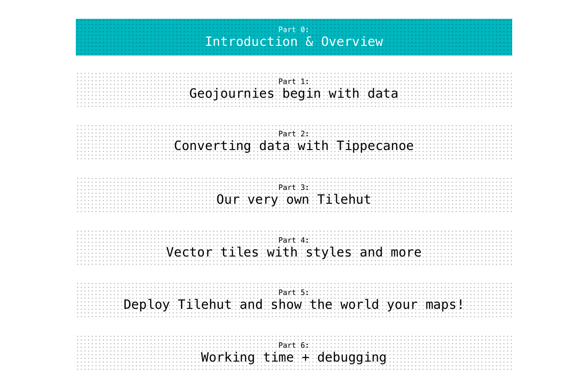

* I'm [joey](jk-lee.com), your workshop host.
* Say hello to eachother! 

* What are we going to accomplish today?
    >- we're going to be visualize data from [Boston's Hubway bike sharing service](https://www.thehubway.com/datachallenge), namely the counts and the sum time to-and-from each station.

* how are we going to do it?
    >- we will use Tippecanoe: a commandline tool to convert our geojson data to vector tiles
    >- we will serve up our tiles using Tilehut.js
    >- we will learn to style our data using the mapbox gl API for vector tile specifications
    >- and finally, we will make a little web visualization that shows our data using a provided html/js/css template.


<br>
<br>

***

<br>
<br>


<!-- ***
***
***
* Part 1 ***
***
***
* -->


## Part 1: Geojournies begin with data

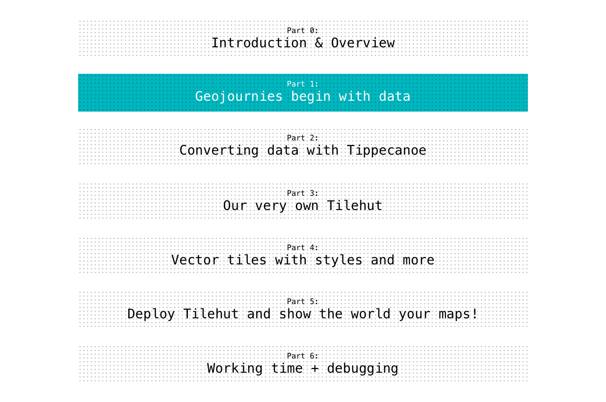


<br>

### Introduction to the data


For this workshop, I've prepared [1 month of Boston's Hubway Bike Service data](https://www.thehubway.com/system-data) from January 2017.  Why January? one of the coldest months of the year? 
> I made the assumption that there would probably be less trips ==> meaning a smaller dataset for us to work with ==> more efficient for the workshop, yet still interesting. (Hooray for data management!)

<!--You can get the [raw data here](https://www.thehubway.com/system-data).-->

The data we will work with are: 

>1. the counts of the trips to-and-from each station, 
>2. the sum time of the trips to-and-from each station, and 
>3. the Hubway Stations

I used a `group-by` function to group the data in a python script which you can find [here](scripts/analysis.py). The data come in a `csv` file with the following fields which are all pretty self explanatory:


>+ 'start station id'
>+ 'start station name'
>+ 'start station latitude'
>+ 'start station longitude'
>+ 'end station id'
>+ 'end station name'
>+ 'end station latitude'
>+ 'end station longitude'
>+ 'count'
>+ 'total_duration' (in seconds)


<br>

### Sketching with 🚴 data 


I made a few attempts to prepare the data in a way that might help us to communicate the volume of Hubway trips occuring across Boston. Here's what I tried:

>**Attempt 1 - as the crow flies origin-destination(OD):** As you can see the data just have a `start` location and `end` location, which when you mapped, look rather hard to read, but you can still see some patterns emerge.

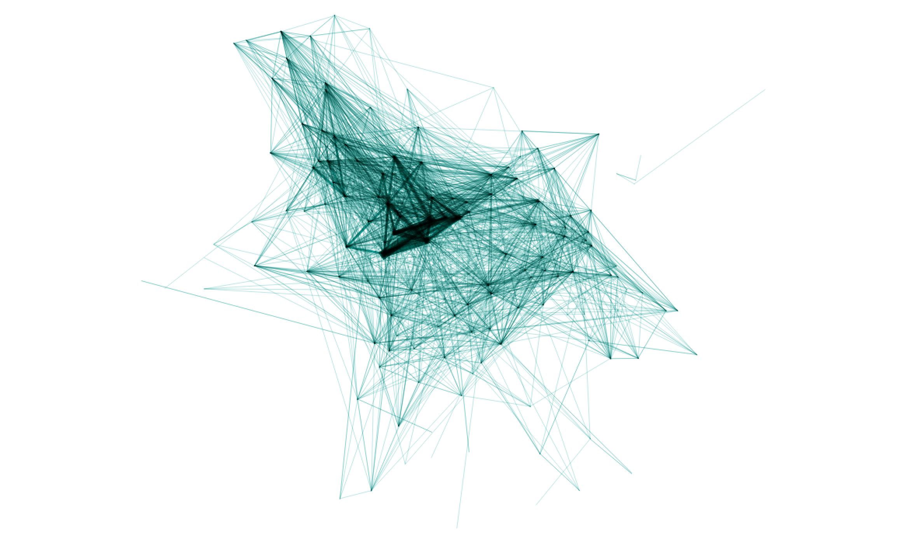


>**Attempt 2 - Bezier ODs:** I tried to add some arcs to see if maybe aesthetically we could squeeze out some love, but I'm not sure that this is so readable either. #thosecurvestho 

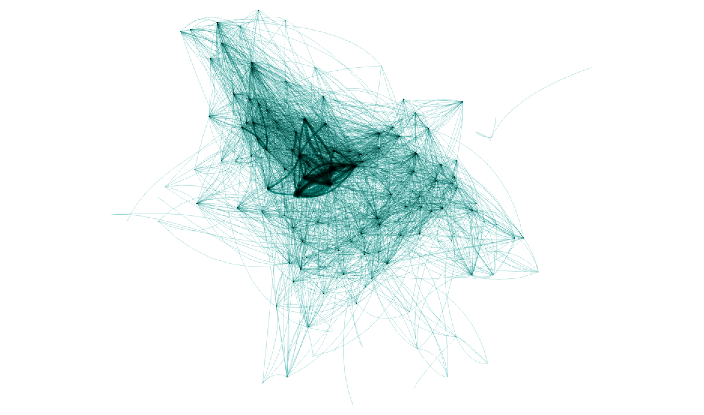


>**Solution - Routed ODs:** Lastly, I decided to plug in all those bike trips into [Graphhopper](https://github.com/graphhopper/graphhopper), which is pretty much my favorite open source routing engine at the moment (shout out to @graphhopper for making great stuffs!) to *take a guess* at where all those trips might have taken place along roads and bike paths throughout Metro Boston. The results look quite convincing - if any native Bostonians might be able to validate, that would be super! 


For the purpose of this workshop, we will use this routed dataset to produce our visualization and learn about serving and styling vector tiles along the way.


<center>👉 The routed data are in: [`data/201701_hubway_routes_all.geojson`](data/201701_hubway_routes_all.geojson) 👈</center>
<center>👉 The hubway stops are in: [`data/hubway_Stations_201606.geojson`](data/hubway_Stations_201606.geojson) 👈</center>

<br>
<br>

***

<br>
<br>


<!-- ***
***
***
* Part 2 ***
***
***
* -->


## Part 2: Converting data with Tippecanoe

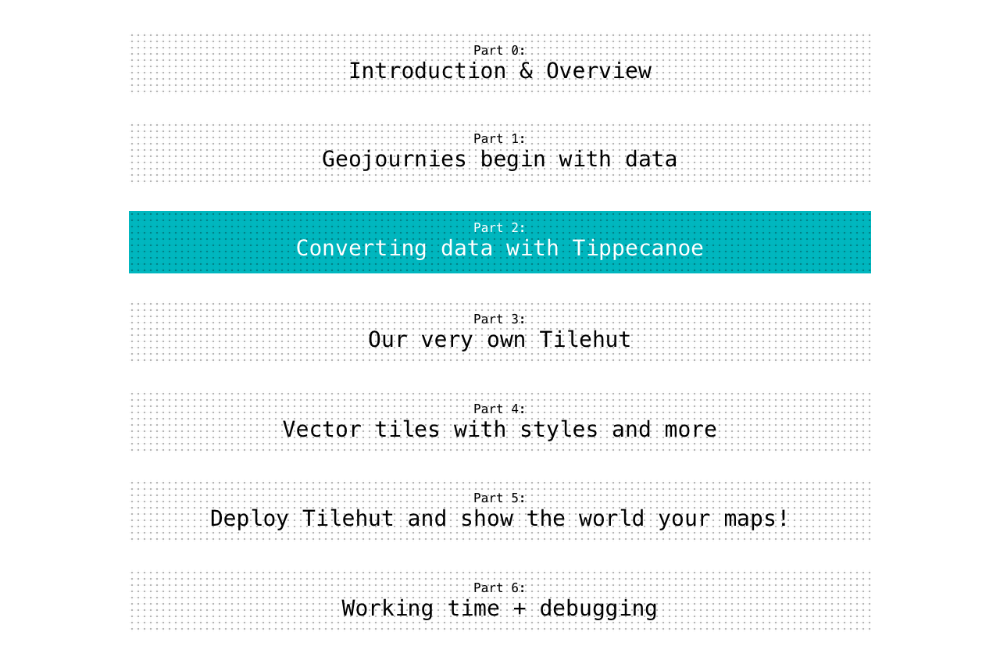

<br>

### What's a Tippecanoe?


So now we've got our bike data bound up in our friendly, but bloated geojson file format. Aren't you just itching to pack up all up into this wonderfully efficient, web friendly thing we call Vector tiles? 

There are a number of ways to achieve this, but the way we're going to do it today is by using an opensource tool by [Mapbox](mapbox.com) called [Tippecanoe](https://github.com/mapbox/tippecanoe). I'm not sure why it is called Tippecanoe, but it is a lovely name and an even lovelier piece of software. The intention behind [Tippecanoe](https://github.com/mapbox/tippecanoe) is to not have to forefeit the details of our data especially when they matter most. [Tippecanoe](https://github.com/mapbox/tippecanoe) does this by taking advantage of some [handy tricks]() such as zoom level based point aggregation and other methods.


<br>

### Installation


If you haven't installed [Tippecanoe](https://github.com/mapbox/tippecanoe), we can do this together later or you can follow the instructions on the project webpage [here](https://github.com/mapbox/tippecanoe). Easiest is if you use [Homebrew](https://brew.sh/) for OSX or [Docker](https://www.docker.com/). 


<br>

### Converting our routed bike trips


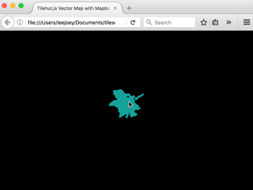

Fire up your terminal and enter the following:

```
# change directories
cd data

# run the conversion
tippecanoe -o hubway-routed.mbtiles -maximum-zoom 13 -l hubwayRouted 201701_hubway_routes_all.geojson 
```

What's happening here: 

>* **tippecanoe**: this calls the tippecanoe function
* **-o  hubway-routed.mbtiles**: says, "our output file will be called hubway-routed.mbtiles in the data folder"
* **-l hubwayRouted**: says, "call our mbtiles hubwayRouted" - we will need this for when we style our tiles; without this, it would call it the name of the file "201701hubwayroutesallgeojson" and that's not so nice.
* **-maximum-zoom 13**: tells tippecanoe to only produce tiles to a max of zoom level 13.
* **201701_hubway_routes_all.geojson**: is the geojson file of our routed bike trips.

The result will be an a file in your data folder called: [hubway-routed.mbtiles](data/hubway-routed.mbtiles)

More on the various Tippecanoe flags can be read about [here]().

In this workshop we aren't going to convert the stations to vector .mbtiles for a number of reasons: 
> * first, the stations are only a few kilobytes (~32) which aren't going to melt your browser, 
> * second, that gives us an opportunity to work with some other aspects of mapbox GL's api. 


<br>

### A note on handling points


If you do find yourself in the position where you need to convert points, know that Tippecanoe is programmed to optimize for things like redundant features for certain zoom levels and other situations. For example if you want to show some points and make sure they don't get aggregated into hiding, you might say:

```
tippecanoe -o mypoints.mbtiles --maximum-zoom 5 --drop-rate 5 --drop-fraction-as-needed mypoints.geojson
```

> What it says is: "create tiles for the max zoom level of 5, and set the rate at which dots are dropped at zoom levels below basezoom (default 2.5) to 5" - So basically don't aggregate points until after the max zoom. It took me a while to figure out why my points were disappearing when it didn't make sense for them to not be displayed...

On the flip side, if you want to handle a bunch of points and you need some fancy ways to take care of this, you can give [this a blog post a read](https://blog.mapbox.com/mapping-extremely-dense-point-data-with-vector-tiles-4052eb409e78).

<br>
<br>

***

<br>
<br>


<!-- ***
***
***
* Part 3 ***
***
***
* -->


## Part 3: Our very own Tilehut

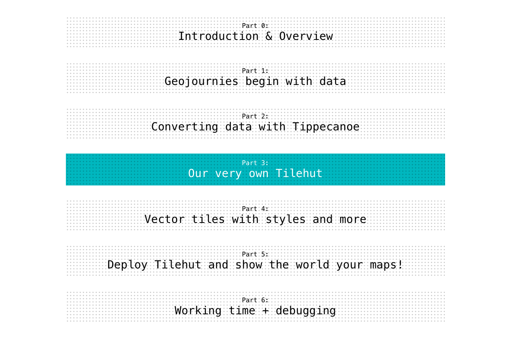

### Say hello to Tilehut.js


So now that we've got our bike trip tiles created, it's time to get our tile server up and running. Ooh so exciting!

There's a number of platform-as-a-service (PaaS) services that, among many things, act as tileservers. You might be familiar with some of the bigger ones like Mapbox, Carto, and Mapzen, but there are plenty of others that you can brew up on your own. 

For this workshop, I'm going to introduce you to [Tilehut.js](https://github.com/b-g/tilehut), a little tileserver that I worked on with a few of my friends to help make it easier to host your own interactive raster and vector tiles. Tilehut.js is just wrapper for a lot of the existing tileserving technology like [Mike Migurski's Tilestache](http://tilestache.org/) and Mapbox's [node-mbtiles](https://github.com/mapbox/node-mbtiles) that was born out of our own want/need to have a bit more control over our data as well as room to experiment. So let's get Tilehut.js running, shall we?


<br>

### Install Tilehut


To install (requires Node.js installed) :

>1. Clone or download the zip of the **TILEHUT-HEROKU Branch of Tilhut.js** from: [https://github.com/b-g/tilehut/tree/tilehut-heroku](https://github.com/b-g/tilehut/tree/tilehut-heroku). 
>2. Fire up your terminal and run:

```
# change into the tilehut directory
cd tilehut
# this installs all the dependencies
npm install 
# this starts the server
npm start
# check in your browser: http://localhost:8000/tiles-world-simple/map/
```


If you see a world map on your screen, you've successfully installed Tilehut.js locally on your machine! We are going to work locally for now but we will setup Tilehut.js on <strike>OpenShift</strike> Heroku so you can show off your data to the world 🌎

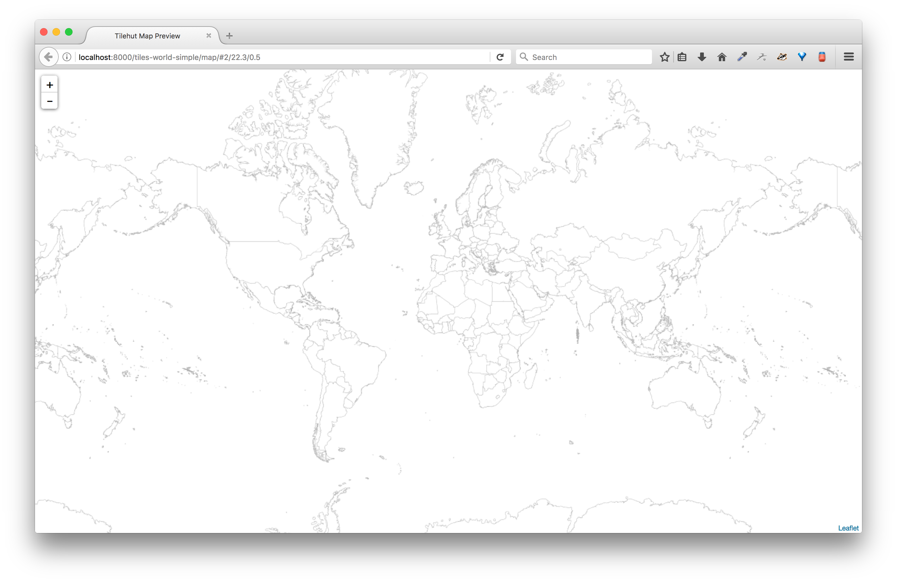

For now, let's explore Tilehut.js a bit. 

*If you're so inclined, you are also welcome to use [tilehut-docker](https://hub.docker.com/r/joeyklee/tilehut-docker/). NOTE: you will have to change the `config.js` for things to work correctly with Heroku since that docker image reflects the setup for OpenShift.*


<br>

### Poke around and inspect


You're probably thinking, "holy guacamole, I never knew it would be so simple to serve up my own tiles!". If not, then here's a link to something [even more impressive](https://www.youtube.com/watch?v=bZ5Gzx7KKqg). But while you're here, let's look into what is included in this Tilehut.js directory.

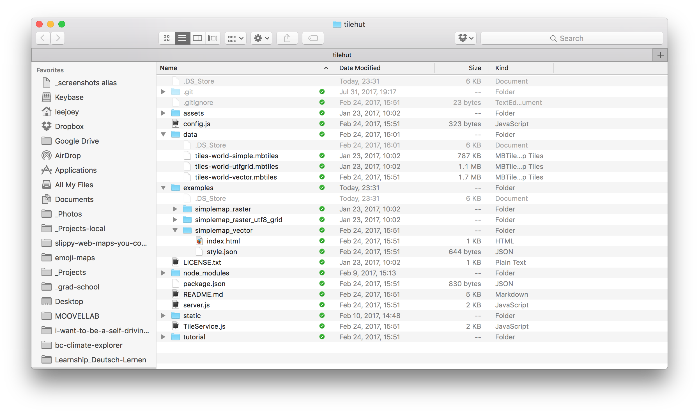

So here's all the subdirectories and files you see that make up Tilehut.js. The ones without a line crossed through them are relevant for you:

>* LICENSE.txt    
>* <strike> assets</strike>
>* examples       
>* <strike>server.js</strike>
>* README.md      
>* <strike>config.js </strike>     
>* <strike>node_modules </strike>  
>* <strike>static</strike>
>* <strike>TileService.js</strike> 
>* data           
>* <strike>package.json</strike> 
>* tutorial

That leaves us with:

>* **LICENSE.txt**: It's the BSD 2-clause "Simplified" License
>* **examples**: a folder of examples that show how to use Tilehut.js with raster and vector tiles.
>* **data**: this is where we're going to put our vector .mbtiles!
>* **README.md**: lots of handy info here       
>* **tutorial**: a detailed tutorial on how to produce raster and vector tiles and how to setup tilehut locally and on openshift. This workshop is a remix/builds on top of the tutorial included in this directory.


<br>

### Breaking down the vector tile example


Since we're going to be working with vector tiles, let's have a look at the `examples/simplemap_vector` directory. Navigate over and double-click on `index.html`. you should see something like this:

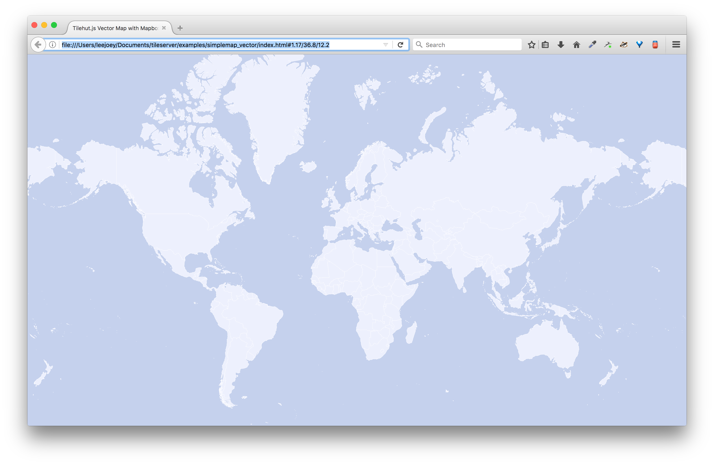

We have 2 files here:

>* index.html
>* style.json

**index.html**: If you open up the `index.html` file, you will see the following:

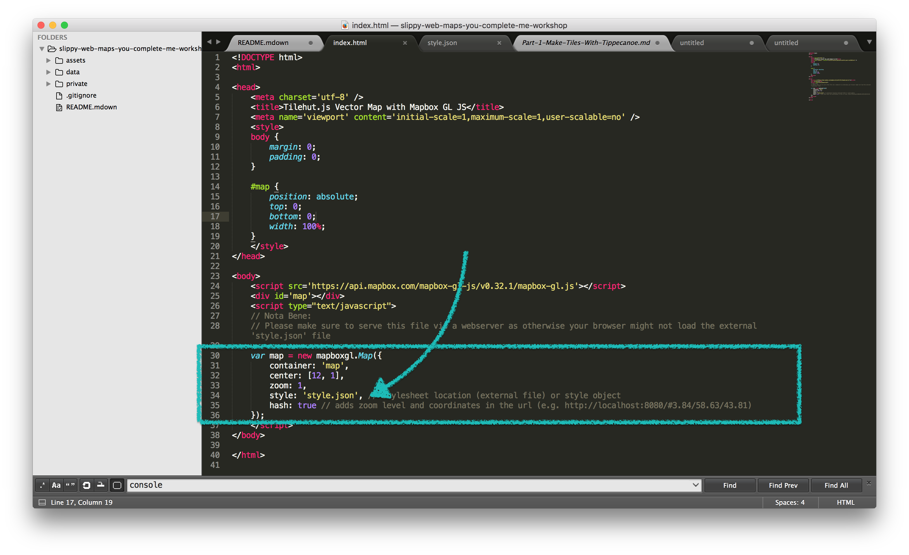

You'll notice: 

>* I've highlighted the javascript code between the `<script></script>` tags
>* and pointed to ↩︎ the property called `style.json`. You might be thinking, "is this is the reference to *our* `style.json` in our folder?" You bet it is! 

**style.json**: so logicaly, we can deduce that our `style.json` is affecting the `style` of our map in this instance. Easy as pie 🍰. If we open our `style.json` file, we will see the following:

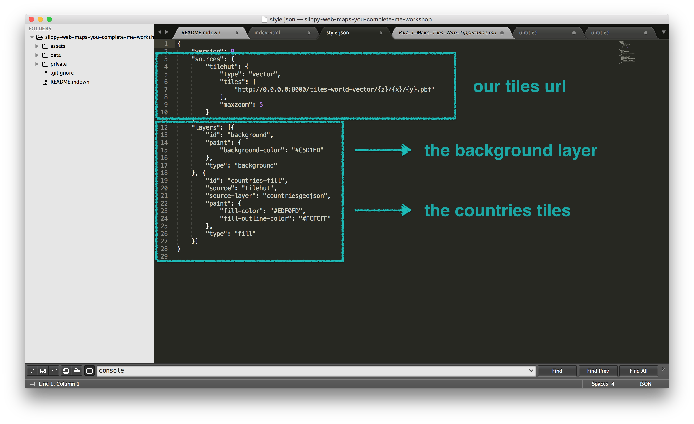

You'll notice:

>* we have a gobbley json file with three main properties:
    - `version`: defines a version of the file
    - `sources`: defines the sources of where our tiles are coming from
    - `layers`: defines what layers will be displayed on the map. 

Lets break down `sources` and `layers` as these are important for the rest of our work:

<br>

#### Sources

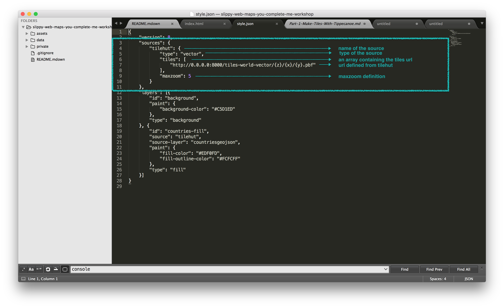

Our sources consist of a json object that could be read like this in pseudo-json-code by:

```
sources: {
  "name of the source": {
    "type": "the type of source" // (vector or raster),
    "tiles": [
        "the url to the tiles being served"
    ],
    "maxzoom": 5 
  }
}
```

NOTE: the `type` of the source will change how the rest of the object is defined (e.g. for `"type": "geojson"` vs. `"type":"image"` vs. `"type": "video"` vs. `"type":"vector"`. For more info see: https://www.mapbox.com/mapbox-gl-js/api/#sources )


Tilehut.js serves the `.mbtiles` in the `/data` folder like so:

```
"http://0.0.0.0:8000/the-name-of-your-mbtile-file/{z}/{x}/{y}.pbf"
```

in this case:

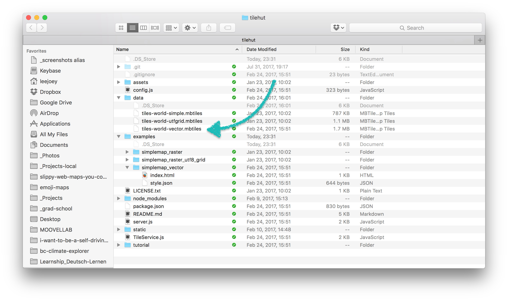

```
"http://0.0.0.0:8000/tiles-world-vector/{z}/{x}/{y}.pbf"
```

Now you can imagine if you placed a `.mbtiles` file called, `hubway-routed.mbtiles` file in the `data` folder, your url might look like this... but we will get to this later:

```
"http://0.0.0.0:8000/hubway-routed/{z}/{x}/{y}.pbf"
```


<br>

#### Layers


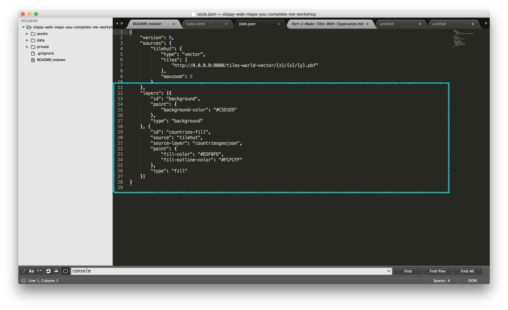

Our layers property is a `list` (a.k.a `array`) which contains the layers being showed on our map.

Each layer in the list has more or less the following properties. More info can be found [here](https://www.mapbox.com/mapbox-gl-js/style-spec/#layers):

>* **id**: this is a unique name you come up with to reference your layer
>* **source**: this is the name of the source where your tiles came from
>* **source-layer**: this is the name `-l` we defined during our Tippecanoe conversion; here it is `countriesgeojson`
>* **visibility**: this is whether the layer is visible or not, takes `true` or `false`
>* **paint**: this is where you define all the style properties of the layer - it is as they say, where all the magic happens. Depending on the `type` of of the layer (explained next), you will have different options. We will explore these further in a bit.
>* **filter**: data in the tiles can be filtered according to the following structure - [see reference here](https://www.mapbox.com/mapbox-gl-js/style-spec/#types-filter).
>* **type**: this is the type of the layer. The types that can be defined will depend on the data in the `.mbtiles`. The current types are:
    - **fill**: A filled polygon with an optional stroked border.
    - **line**: A stroked line.
    - **symbol**: An icon or a text label.
    - **circle**: A filled circle.
    - **fill-extrusion**: An extruded (3D) polygon.
    - **raster**: Raster map textures such as satellite imagery.
    - **background**: The background color or pattern of the map.

In the case of our example map, we can see that we have 2 layers defined by the ids:

>* background
>* countries-fill

> **background** is a type of layer that can be included in any project. We define this `background-color` with a hexcode. Want to try changing it? Go ahead! Need a suggestion, try: `#deeded`

> **countries-fill**: is a `type:fill` layer which is used for polygons. Since our countries are polygons, this makes sense.  Here you can see we've correctly defined `source: tilehut`, and `source-layer: countriesgeojson` which is what the .mbtiles name is . Why don't you try changing the `fill-color` and the `fill-outline-color` to `#cadfad`. Don't be shy, it won't break! 

you might end up with something like this:

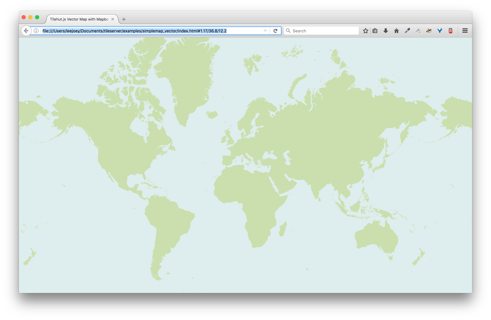


**NOTE**: If you ever are wondering why your styles aren't working, make sure to check that you've correctly defined the `type` property!

<br>
#### Getting the meta information from your tiles: meta.json 

At some point you will have to check what a vector tile layer is called. This isn't apparent by the file name itself, but you can dig into the details of a vector tile layer by you can quering it using Tilehut by using the `/meta.json` endpoint:

```
"http://0.0.0.0:8000/the-name-of-your-mbtile-file/meta.json"

or, in this case:

"http://0.0.0.0:8000/tiles-world-vector/meta.json"
```

You will get back a result that looks like this:

```
{
  "scheme": "tms",
  "basename": "tiles-world-vector.mbtiles",
  "id": "tiles-world-vector",
  "filesize": 1703936,
  "name": "tiles-world-vector.mbtiles",
  "description": "tiles-world-vector.mbtiles",
  "version": "2",
  "minzoom": 0,
  "maxzoom": 5,
  "center": [
    16.875,
    44.951199,
    5
  ],
  "bounds": [
    -180,
    -85.051129,
    180,
    83.633811
  ],
  "type": "overlay",
  "format": "pbf",
  "vector_layers": [
    {
      "id": "countriesgeojson",
      "description": "",
      "minzoom": 0,
      "maxzoom": 5,
      "fields": {}
    }
  ]
}
```

In the `meta.json` you can see all sorts of information like the `id`, `center coordinates`, `filesize`, and so on.

Before we continue, let's take a quick break before getting back into business. As a recap so far:

We have:

>1. been introduced to the data we're using
>2. Used Tippecanoe to convert geojson to vector tiles
>3. Setup and navigated around Tilehut.js


<br>
<br>

***

<br>
<br>


<!-- ***
***
***
* BREAK ***
***
***
* -->
🎉❤️⚡️✨🦄🌈🎉❤️⚡️✨🦄🌈🎉❤️⚡️✨🦄🌈🎉❤️⚡️✨🦄🌈🎉❤️⚡️✨🦄🌈


# Intermission! [Open source stretch](https://github.com/mozillascience/working-open-workshop/issues/42) + bio break

```
Reach up for all of our open source dreams (arms up)
Reach down to the grassroots (reach toes)
Come back up in the blowing of the winds of change (arms back and forth)
Reach out and shake the money tree in time for grant applications (arms forward, shake imaginary tree)
Lean left to avoid the NSA (hands on hips, lean left)
Lean right to avoid the NSA (hands on hips, lean right)
Go all around to avoid the NSA (hands on hips, lean all around)

```

🎉❤️⚡️✨🦄🌈🎉❤️⚡️✨🦄🌈🎉❤️⚡️✨🦄🌈🎉❤️⚡️✨🦄🌈🎉❤️⚡️✨🦄🌈

<br>
<br>

***

<br>
<br>


<!-- ***
***
***
* Part 3.5 ***
***
***
* -->


## Part 3.5


In the next sections we are going to:

>1. serve up our bike trip vector tiles locally using Tilehut.js
>2. style our bike trip vector tiles and our bike station geojson using MapboxGL's vector tile specifications while looking at some code refactoring
>3. Setup Openshift and serve up our tiles to our own Tilehut server


<br>

### Serve up your bike trips tiles


Let's start by throwing our hubway bike trips into our Tilehut `data/` folder. Take your `data/hubway-routed.mbtiles` from the workshop folder and move them ==> to the `tilehut/data/` folder. 

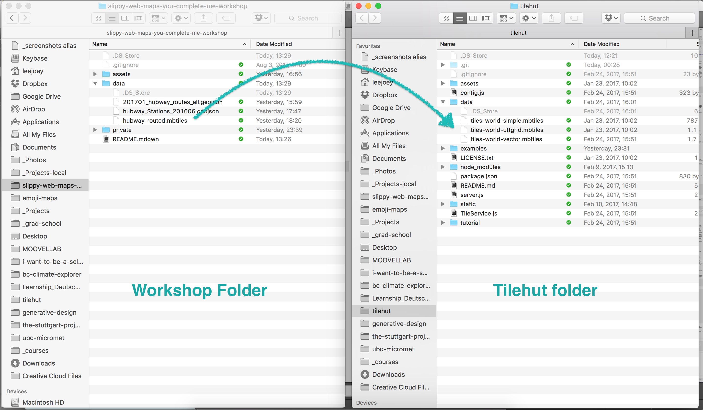

To check if the tiles are now in there, let's check the `meta.json` of our hubway trips by checking this url:

```
"http://0.0.0.0:8000/hubway-routed/meta.json"
```

If all is good, we should see this:

```
{
  "scheme": "tms",
  "basename": "hubway-routed.mbtiles",
  "id": "hubway-routed",
  "filesize": 2404352,
  "name": "data/hubway-routed.mbtiles",
  "description": "data/hubway-routed.mbtiles",
  "version": "2",
  "minzoom": 0,
  "maxzoom": 14,
  "center": [
    -71.070557,
    42.366661,
    14
  ],
  "bounds": [
    -71.166373,
    42.303396,
    -71.005666,
    42.401376
  ],
  "type": "overlay",
  "format": "pbf",
  "vector_layers": [
    {
      "id": "hubwayRouted",
      "description": "",
      "minzoom": 0,
      "maxzoom": 14,
      "fields": {
        "count": "Number",
        "end_station_id": "Number",
        "end_station_latitude": "Number",
        "end_station_longitude": "Number",
        "end_station_name": "String",
        "id": "String",
        "routeLink": "String",
        "start_station_id": "Number",
        "start_station_latitude": "Number",
        "start_station_longitude": "Number",
        "start_station_name": "String",
        "total_duration": "Number"
      }
    }
  ]
}
```

If this isn't what you see, then check to make sure your tileserver is running and that you've got the correct name to the `.mbtiles` file in the `tilehut/data` directory. Otherwise, now our tiles are being served and it's time to style 'em up!  


<br>
<br>

***

<br>
<br>


<!-- ***
***
***
* Part 4 ***
***
***
* -->


## Part 4: vector tiles with styles and more

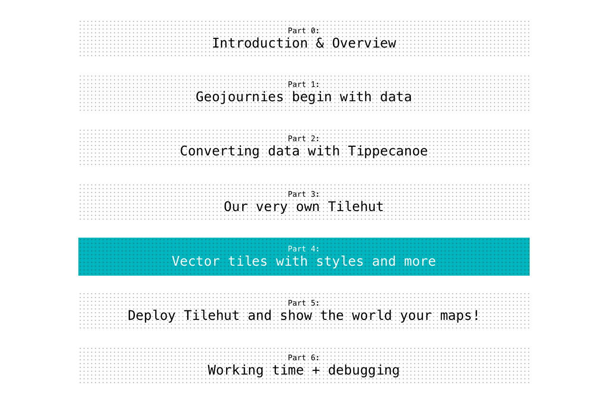

Here in part 4, we're going to simultaneously learn about: 

>1. how to style our data using mapboxGL's vector tile specifications 
>2. refactoring our existing code for more flexibility with styling


<br>

### Examples/01-trips


Navigate over to our `examples/01-trips` folder and take a look inside. The files you see in there should look familiar, containing:

>* index.html
>* style.json

Open the `index.html` file in your browser to see what is cooking. 

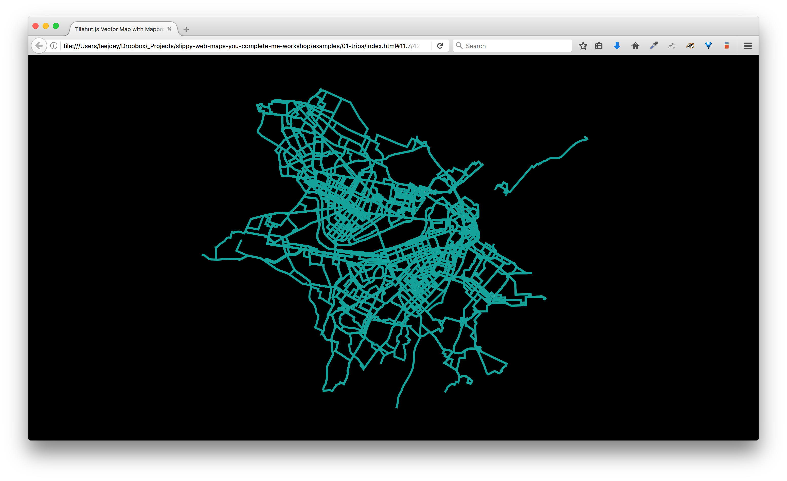

Lo and behold, our routed hubway trips! While the visualization is really simple and not that useful, our tiles are being served up as we expect. So that's a start. 

If you open up the `index.html` and the `style.json` files in your text editor, you will notice that the `index.html` file is identical to the example we saw earlier. However if we open our `style.json` file, we will see that there are some changes. 

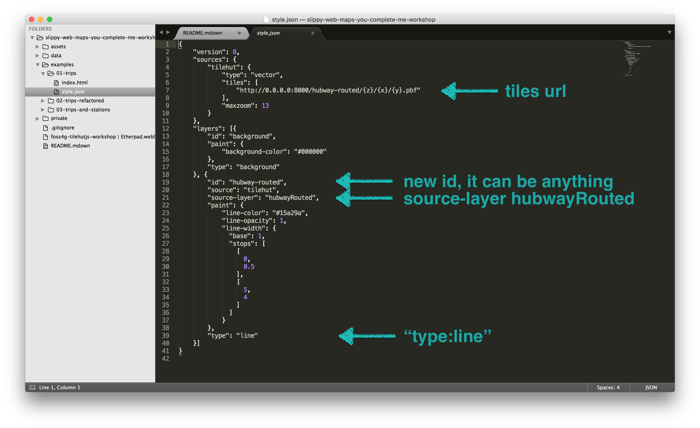

>* our `tiles url` now reflects the name of our tileset being served on our tileserver: `http://0.0.0.0:8000/hubway-routed/{z}/{x}/{y}.pbf`
>* we have a new `id` for our tileset, obviously different from that of our countries data we saw earlier
>* we set the `source-layer: hubwayRouted` to what we named the tiles earlier in our Tippecanoe command; remember: you can use the `.../meta.json` api endpoint to tilehut to get the metadata of your tiles.


<br>

### Examples/02-trips-refactored


Now navigate over to `examples/02-trips-refactored`. You will notice some key differences from our previous examples, namely:

> * **FIRST:** we have now a mapbox api key defined and replaced our map objects `style: "style.json"` with the Mapbox light-v9 style: `"mapbox://styles/mapbox/light-v9"` ==> this means we now have a styled basemap shown.

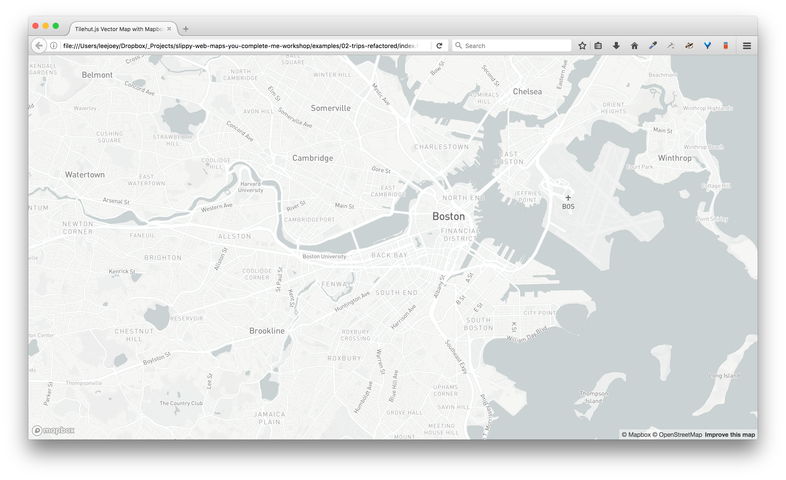

> * **SECOND:** we introduce two main functions: `map.addSource() ... map.addLayer()`. These allow us to take an existing style, such as the Mapbox light-v9 style and add on top of that. This is really cool especially if you've designed some sweet basemaps using Mapbox Studio, Maputnik or your editor of choice.  

>* `map.addSource("source-id", {object with the source definitions})`
	+ description:
    * this function adds a new source to our map. 
  + parameters:
    * `source-id`: 
        - this is a name of our source. So far we've been calling our source "tilehut", but you might venture so far as to calling it "tilehut-trips" or something else that reflects what we're looking at.
    * `{object with the source definitions}`: 
        - this is our object that contains the info about the source such as `type:vector`, `tiles:["link/to/tiles"]`, etc.
>* `map.addLayer({object with layer definitions})`
  + description: 
      * this function adds a new layer to the map
  + parameters:
      * `{object with the layer definitions}`: 
          - this is our object that contains the info about our layer's `paint`, `type`, etc. 
  

This pattern `map.addSource()... map.addLayer()` is something that you might encounter as you work more with vector tiles. 

>* **THIRD:** We define the`{object with layer definitions}` and assign them to variables within our code. Here we create an `{object with layer definitions}` for... 
	- hubwayHaloTripStyle: for creating a halo like effect
	- hubwayTripStyle: the main paths where the trips occured

>...then stick each into an `map.addLayer()` functions to make those styles appear. Note: each of those styles has a different `id` 😉

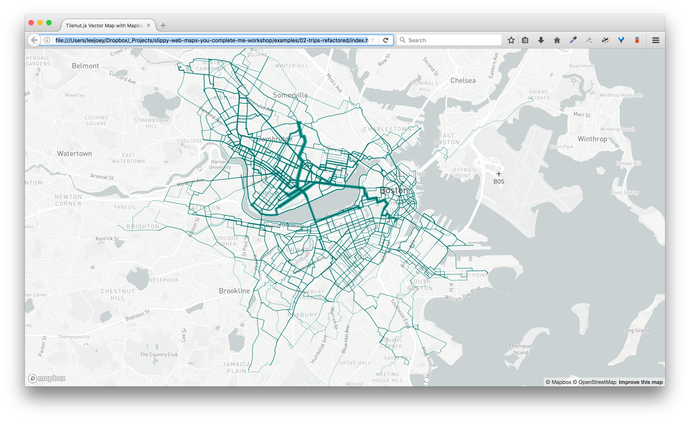

<br>

#### layer style check

Before we continue, let's just have a look at the layer definition for the `hubway-routed-halo` layer. 

```
{
    "id": "hubway-routed-halo",
    "source": "tilehut-hubway-routes",
    "source-layer": "hubwayRouted",
    "paint": {
        "line-color": "#15a29a",
        "line-opacity": 1,
        "line-blur": 2,
        "line-width": {
            "property": "count",
            "base": 1,
            "stops": [
                [
                    0,
                    1
                ],
                [
                    200,
                    10
                ]
            ]
        }
    },
    "type": "line",
    "line-cap": "round",
    "line-join": "round"
};
```

Here we can see some new changes to our style:

>* "source": 
    - notice it now just references the name of the source id we defined earlier
* "line-blur":
    - we add some nice line-blur to get a halo like feeling
* "line-width:{}":
    - "property": "count",
        + notice we've added a "property:count". This says, "give me the count property from our data", and then style the data based on these data.
    - "base":
        + base says, how the interpolation should be done between 
    - "stops":
        + this is a list of lists that defines, "for the given `"property":"count"`, give me [the value of count, the line-width]"
* "line-cap" & "line-join": you can take a look at the different possibilities [here](https://www.mapbox.com/mapbox-gl-js/style-spec/#layers-line).


<br>

### Examples/03-trips-and-stations


Now that we have our bike trips styled and looking all nice and shiny, the next step is to add our `bike stations` data to the map. 

The only things we haven't yet seen here are:

>* **FIRST**: We use jquery's `$.getJSON()` function to read in our geojson station data. (note: I've added the reference to the jquery library)

```
$.getJSON("hubway_Stations_201606.geojson", function(myStations) {
    // all of our code now goes in here ...
    // all of our code now goes in here ...
    // all of our code now goes in here ...
});
```

Note: we put all of our code inside getJSON callback to make sure our data is loaded before we do anything.

>* **SECOND**: We add a new layer source to our map. :
    - We set the new source to `"type":"geojson"` since our data is a geojson file and ==> 
    - then we take the data that we read in from the `$.getJSON()` request called `myStations` and ==> 
    - set that to the `"data": myStations`. This allows us to now style our stations as we've done with our trip layer style.

```
map.addSource("station-geojson", {
    "type": "geojson",
    "data": myStations,
});
```

>* **THIRD**: we add 2 new layer style definitions with `"type": "circle"` and `"type": "symbol"`. You can see the each type has it's own style properties which are shown in the documentation [here]() and [here](). 

>* **LAST**: we add the layers in the order that we want them to appear, from bottom to top:

```
// add our trip halo style
map.addLayer(hubwayHaloTripStyle);
// add our trip layer style
map.addLayer(hubwayTripStyle);
// add station layer style
map.addLayer(hubwayStationStyle);
// add the labels style
map.addLayer(hubwayLabelStyle);
```

<center> 🎉And voila! We have a trip counts map 🎉 </center>

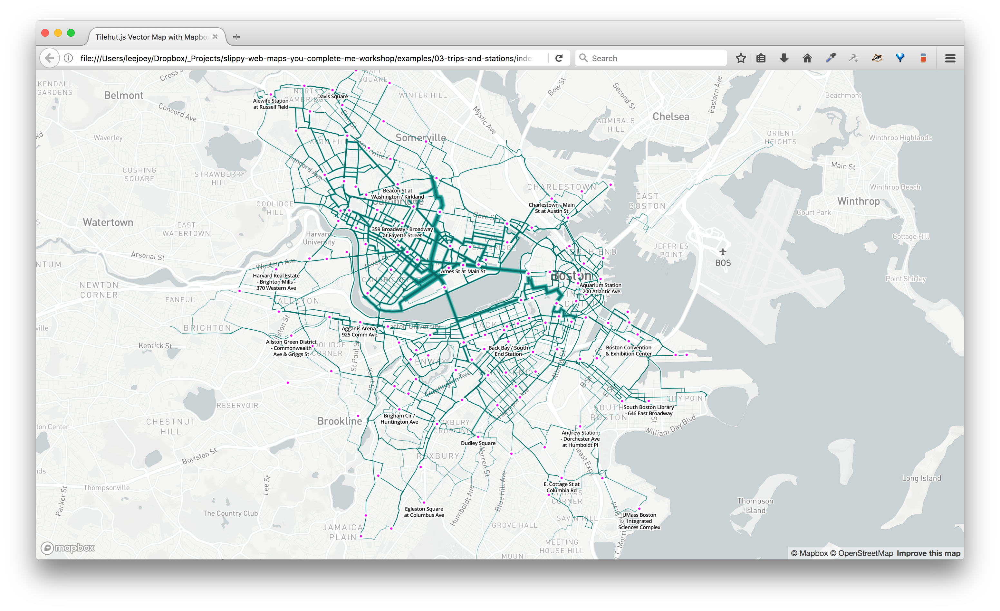


<br>
<br>

***

<br>
<br>


<!-- ***
***
***
* PART 5 ***
***
***
* -->


## Part 5: Deploy Tilehut and show the world your maps!

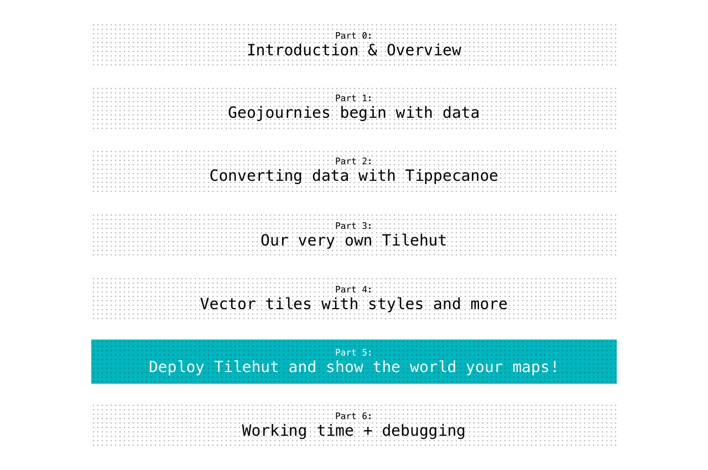

Now we're ready to get our tiles online. In this section we will (assuming the wifi is good enough):

>1. turn our project into a git repository.
>2. setup <strike>Openshift</strike> Heroku
>2. change the links within our locally developed project
>3. make some style changes (optional)
>4. share our project out in the world using github pages


<br>

### Get your git on


Before we can deploy to Heroku, we need to turn our Tilehut.js (tilehut-heroku branch) into a `git repository`. To turn our current Tilehut.js directory into a `git` repository, follow the steps below:

> We're first going to initialize the repository with:

```
git init
```

> next we will add all the files we want to be tracked by git:

```
git add .
```

> last, we commit all of our files, in our initial commit:

```
git commit -m "initial commit"
```


<!-- https://devcenter.heroku.com/articles/git -->


<br>

### Setup <strike>Openshift</strike>Heroku & deploy


<!-- 
> SO the setup guide to Openshift provided in Tilehut is pretty excellent, so let's follow along [here](https://github.com/b-g/tilehut/tree/master/tutorial#option-2-via-openshift) 
-->

*"Heroku is a cloud platform as a service (PaaS) supporting several programming languages that is used as a web application deployment model".* I just want to emphasize that this is a temporary solution - stay tuned for updates!

> First and foremost, you will need an account with [Heroku](https://dashboard.heroku.com/) - Heroku offers a free account (~5 projects, and ~500mb of storage). [Please make an account](https://dashboard.heroku.com/) and go through the sign up procedures. 


> Next, you will need to download the command-line tools. These can be found here [Download Heroku's CLI Tool](https://devcenter.heroku.com/articles/heroku-cli#download-and-install)

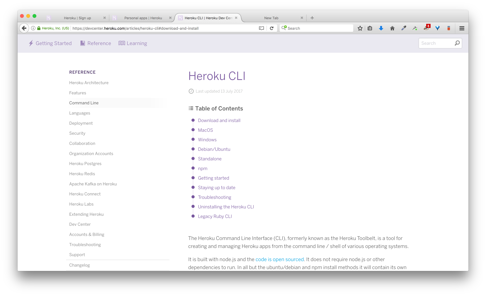

For your convenience, I've included the links here:

> * MacOSX: [Heroku CLI OSX tools](https://cli-assets.heroku.com/branches/stable/heroku-osx.pkg)
* Windows: [32-bit Heroku CLI Windows tools](https://cli-assets.heroku.com/branches/v6/heroku-windows-386.exe) OR  [64-bit Heroku CLI Windows tools](https://cli-assets.heroku.com/branches/v6/heroku-windows-amd64.exe)
* Debian/Ubuntu: `wget -qO- https://cli-assets.heroku.com/install-ubuntu.sh | sh`

Once the tools are installed, please login using the commandline:

```
# you will be asked for your email and password
heroku login
```

Now we will follow the instructions on deploying a git repository to Heroku starting from [Creating a Heroku Remote](https://devcenter.heroku.com/articles/git#creating-a-heroku-remote).

> First, we will create an app which I will call `hubway-tiles` (you'll have to come up with another name since Heroku won't accept duplicates... get creative!):

```
cd <tilehut-tilehut-heroku folder>
# heroku create <name of your app>
heroku create hubway-tiles

# the result will look something like the below
# Creating ⬢ hubway-tiles... done
# https://hubway-tiles.herokuapp.com/ | https://git.heroku.com/hubway-tiles.git
```


> Next, we should check that our remote git is linked to our heroku app:

```
git remote -v

# the result will look like the below
# heroku    https://git.heroku.com/hubway-tiles.git (fetch)
# heroku    https://git.heroku.com/hubway-tiles.git (push)
```

> We can now push our git project to heroku:

```
git push heroku master
```

> You're going to see a bunch of terminal output, but once it is over, let's check to see what's going on over in Heroku land:

```
# this will print out the logs from the heroku server
heroku logs

# the last output should be something like:
# Tilehut on http://...
```

> Now if I you go to: [https://hubway-tiles.herokuapp.com/](https://hubway-tiles.herokuapp.com/) I will see 🙂. Remember, your link will be different from mine.:

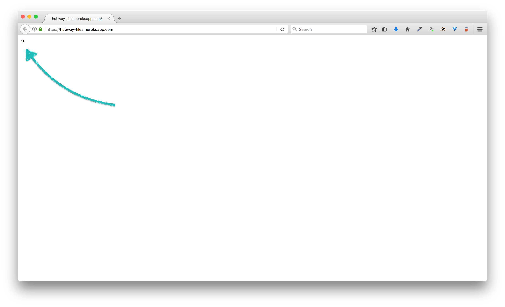

You can check to see if the `meta.json` is returning any results (your url will look different from mine!):

[https://hubway-tiles.herokuapp.com/hubway-routed/meta.json](https://hubway-tiles.herokuapp.com/hubway-routed/meta.json)

If that works, we should have our tiles available at the address, something like:

> https://hubway-tiles.herokuapp.com/hubway-routed/hubway-routed/{z}/{x}/{y}.pbf


<br>

### Change links within local projects

Now that our data is being served from our deployed Tilehut server, all we need to do is replace the local tile URL with the  our remotely served tiles URL. Give that a try!


If you need a hint. Our URL should change from:

```
map.addSource('tilehut-hubway-routes', {
  "type": "vector",
  "tiles": [
   "http://localhost:8000/hubway-routed/{z}/{x}/{y}.pbf"
  ]
});
```

to: 

```
map.addSource('tilehut-hubway-routes', {
  "type": "vector",
  "tiles": [
   "https://hubway-tiles.herokuapp.com/hubway-routed/{z}/{x}/{y}.pbf"
  ]
});
```

<br>

### Add style changes


This whole time we've been working off the styles I've defined for the data, but there are a number of other styles that can be explored. Some suggestions are:

>* try changing the colors of the lines and the stations
>* Adjust the representation of the `line-width` properties of the trips - could they be wider for more emphasis?
>* change the `line-cap` and `line-join` properties. what happens?
>* change the stations label style - make them larger or change the font.
>* add popups to our data using the example [here](https://www.mapbox.com/mapbox-gl-js/example/popup-on-click/). 

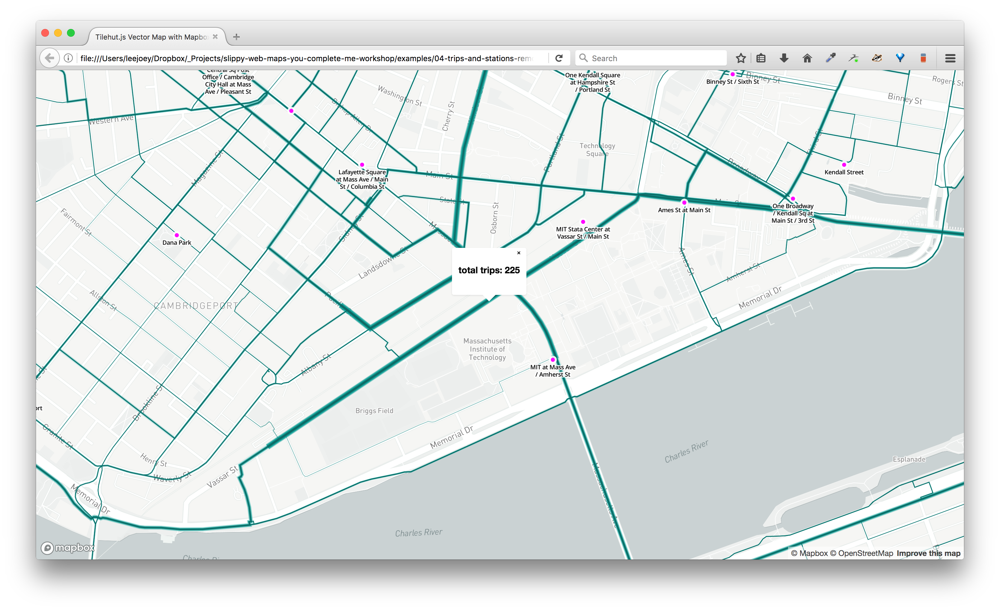


<br>

### Deploy using Github pages


> And now to close the circle, we can host our project on github pages so we can show our map to the world! 

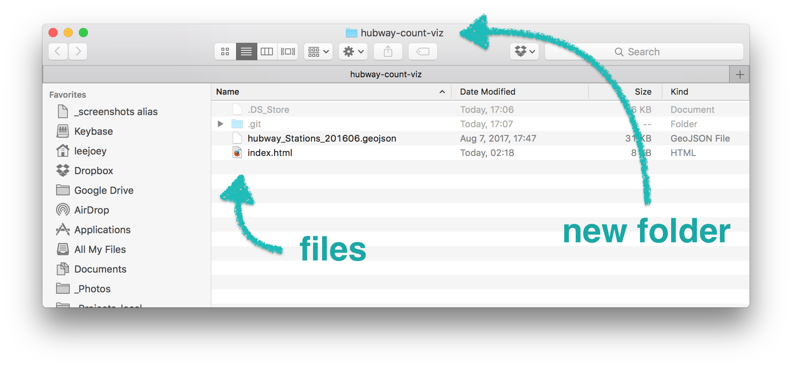

> To make a github pages website, here's a pretty [well documented and beginner friendly example here](http://docs.pinegrow.com/host-html-website-github-pages-free/). 


<br>
<br>

***

<br>
<br>


<!-- ***
***
***
* CONCLUDING REMARKS AND WORKING TIME ***
***
***
* -->


## Part 6: Concluding remarks / Working time / Debugging

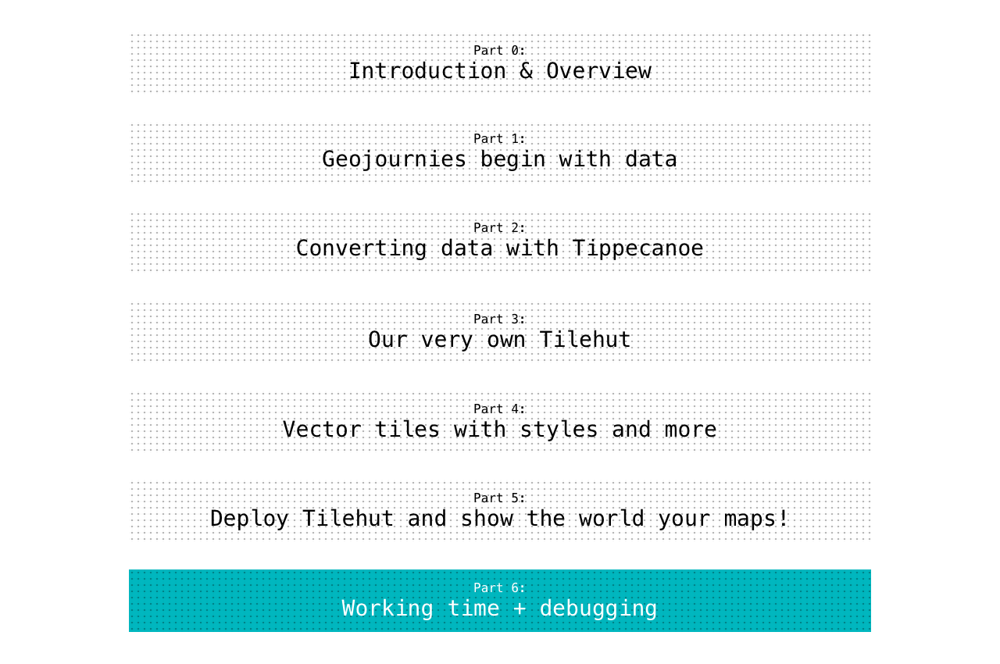


🌈🦄🌈🦄🌈🦄🌈🦄🌈🦄🌈🦄🌈🦄🌈🦄🌈🦄🌈🦄🌈🦄🌈🦄🌈🦄🌈🦄

<br>

### Next steps

<center> </center>

My recommendation is to take your own data and go through each step, from converting data, tweaking parameters in Tippecanoe, styling the vector tiles, and pushing your tiles to your remote server. Practice, practice, practice! 

If you don't have your own data, we haven't talked about styling our `total_duration` yet, but we now have all the components we need to do so. During our open working session, you're welcome to come up with a style for the `total_duration` or work on your own data. 

We covered a lot and there's more yet to explore. How about making a [little map app that displays different layers on button clicks](https://www.mapbox.com/mapbox-gl-js/example/toggle-layers/)? 

The next hour or so will be dedicated to collaborative working time, debugging, and lots of trial and error. Let's take this time to make all the things! 

### Data links:

* [OpenFlights - Make a beautiful flight map. @tmcw has an easy data downloader for that](https://github.com/node-geojson/openflights-geojson)
* [Boston 311 Service Request Data - what do Bostonians complain about?](https://data.cityofboston.gov/City-Services/311-Service-Requests/awu8-dc52)
* [Vancouver Street trees data - with also lots of other meta info, requires some munging](http://data.vancouver.ca/datacatalogue/streetTrees.htm)
* [World Meteorite Landings - yes, it's been done a bunch, but why not make your own map?](https://www.theguardian.com/news/datablog/interactive/2013/feb/15/meteorite-fall-map)


🌈🦄🌈🦄🌈🦄🌈🦄🌈🦄🌈🦄🌈🦄🌈🦄🌈🦄🌈🦄🌈🦄🌈🦄🌈🦄🌈🦄


<br>
<br>

***

<br>
<br>


## Shareouts + Closing

Anyone want to share what they've made?


<br>
<br>

***

<br>
<br>

## Handy Reference links

* [Introduction to styling data with Maputnik](https://www.youtube.com/watch?v=XoDh0gEnBQo&feature=youtu.be)
* handy way to reduce coordinates: `ogr2ogr -f GeoJSON -dsco "COORDINATE_PRECISION=6" boston-flights-small.geojson boston-flights.geojson -progress`
* handling lots of points with tippecanoe: https://blog.mapbox.com/mapping-extremely-dense-point-data-with-vector-tiles-4052eb409e78
* Explanations for mapboxgl terms: http://schwanksta.com/blog/vector-tiles-introduction-pt1
* alternative tileservers, Klokantech's tileserver-gl: https://github.com/klokantech/tileserver-gl
* adding raster tiles on top of vector tiles: https://bl.ocks.org/danswick/c19fec2e92e00967458d
* use the "tiles" array to specifify your 3rd party tiles: https://github.com/mapbox/mapbox-gl-js/issues/866
* tilehut-docker: https://hub.docker.com/r/joeyklee/tilehut-docker/tags/\
* [joeyklee.github.io/geosandbox](joeyklee.github.io/geosandbox): a handy little interactive reference for working with the web geo libraries.

